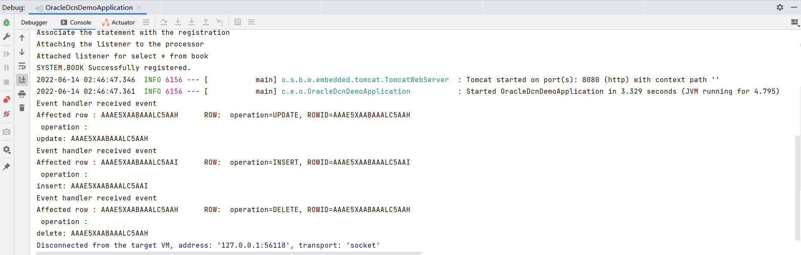

### docker启动Oracle11
```shell
docker run -d -p 1521:1521 -p 47632:47632  oracleinanutshell/oracle-xe-11g

docker ps

docker exec -it 378cd03f4222 bin/bash

root@378cd03f4222:/# /u01/app/oracle/product/11.2.0/xe/bin/sqlplus

SQL*Plus: Release 11.2.0.2.0 Production on Mon Jun 13 06:40:34 2022

Copyright (c) 1982, 2011, Oracle.  All rights reserved.

Enter user-name: system
Enter password: oracle
Connected to:
Oracle Database 11g Express Edition Release 11.2.0.2.0 - 64bit Production

SQL> grant change notification to system;

Grant succeeded.

SQL> commit;

Commit complete.

SQL> create table book(id number(10) primary key, name varchar2(128) not null);

select * from user_change_notification_regs;

Table created.
SQL> insert into book values(1, 'sdfsfdsf');
```

### 官方文档
https://docs.oracle.com/cd/E11882_01/java.112/e16548/dbchgnf.htm#JJDBC28818

需要关注参数设置

### 验证截图

